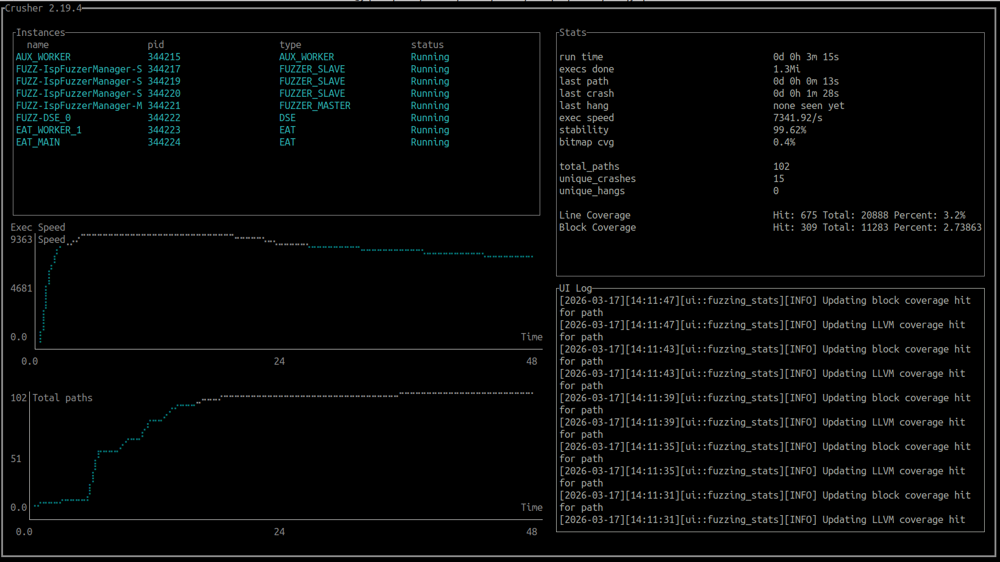
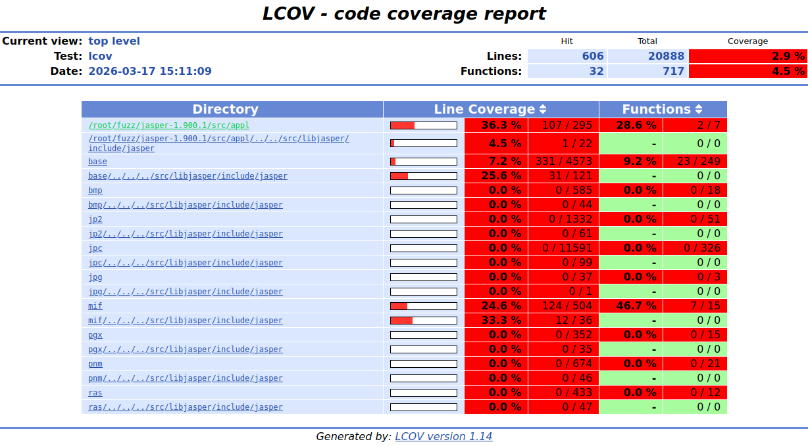
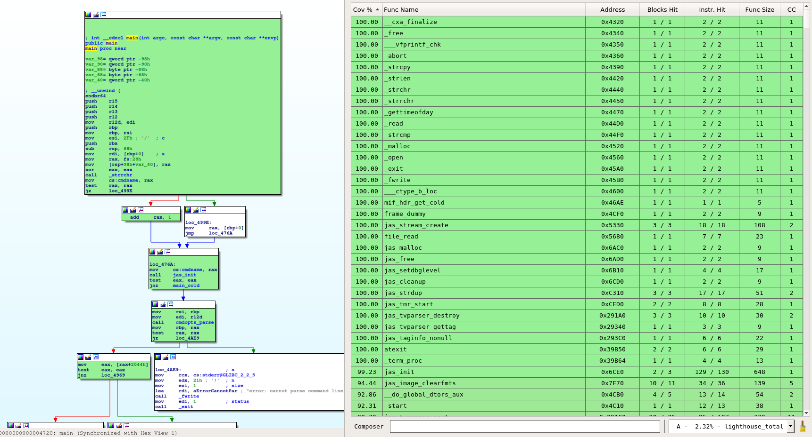

Фаззинг `JasPer` с помощью `Crusher`.
Рассмотрен процесс подготовки к фаззингу, его запуск и мониторинг, а также структура и формат результатов.

# 1. Фаззинг-цель

`JasPer` - ПО для работы с изображениями различных форматов.

Выбрана следующая команда запуска:
```shell
$ jasper -f <path> -t mif -F Out_tmp -T mif
```
где:
- `-f <path>` - путь до входного файла;
- `-t <format>` - входной формат файла;
- `-F <path>` - путь до выходного файла;
- `-T <format>` - выходной формат файла.

Таким образом, входной файл преобразуется из одного формата в другой.
В процессе фаззинга будет мутироваться вх. файл.

# 2. Подготовка к фаззингу

## 2.1. Сборка докер-образа

Создадим докер-образ с установленными для фаззинга зависимостями и множеством сборок `JasPer` с различными типами инструментации:

1. Сборка для фаззинга - `/root/fuzz/jasper-fuzz/bin/jasper`.
Данный бинарь проинструментирован с использованием стандартных компиляторов из AFL++ для получения обратной связи по покрытию.
2. Сборка для отчёта о покрытии бинарного кода (lighthouse) - `/root/fuzz/jasper-clean/bin/jasper`.
В данном бинаре не применяется инструментация.
3. Сборка для отчёта о покрытии исходного кода (cov) - `/root/fuzz/jasper-cov/bin/jasper`.

Сборка образа `ubuntu22_jasper`:
```shell
$ ./docker/docker_build.sh
```

Использование докер-образа не является обязательным и используется здесь в качестве стабильно воспроизводимого окружения.

## 2.2. Подготовка докер-контейнера

1. Создать контейнер (укажите актуальный путь до директории `crusher`):
```shell
$ ./docker/docker_run.sh <crusher_dir> [hasp_ip]
```
где:

- `crusher_dir` - директория `crusher/`;
- `hasp_ip` - IP сервера лицензий.

# 3. Фаззинг

1. Запуск фаззинга (fuzz.sh):
```shell
$ echo core >/proc/sys/kernel/core_pattern
$ /opt/crusher/bin_x86-64/fuzz_manager --start 4 --eat-cores 2 --dse-cores 1 \
                                       -I StaticForkSrv --bitmap-size 65536 \
                                       -i in -o out \
                                       --clean-binary /root/fuzz/jasper-clean/bin/jasper \
                                       --coverage-binary /root/fuzz/jasper-cov/bin/jasper \
                                       -- /root/fuzz/jasper-fuzz/bin/jasper -f @@ -t mif -F Out_tmp -T mif
```
где:

- `--start <num>` - число фаззинг-процессов;
- `--eat-cores <num>` - число процессов доп. анализа (Extra Analysis Tool, EAT);
- `--dse-cores <num>` - число процессов динамического символьного выполнения (Dynamic Symbolic Execution, DSE);
- `-I <type>` - тип инструментации;
- `-i <path>` - путь до директории с начальными образцами входных данных;
- `-o <path>` - путь к выходной директории с результатами фаззинга;
- `--clean-binary <path>` - бинарь без инструментации;
- `--coverage-binary <path>` - проинструментированный бинарь для получения отчёта о покрытии исходников.

Символы `--` разделяют опции крашера и самой исследуемой программы.
Спецификатор `@@` в процессе фаззинга заменяется на файл с мутированными данными.
При необходимости указать критерий останова фаззинга, который заключается в остановке роста покрытия в течение N секунд, необходимо указать переменную окружения AFL_EXIT_ON_TIME.
Пример для 2ч без роста покрытия:
```shell
$ export AFL_EXIT_ON_TIME=7200
```

Однопоточный запуск можно проверить через скрипт `fuzz-1.sh`. Рост числа путей (поле "total paths") говорит об успешном запуске.

2. Мониторинг (в другом терминале).

1) Зайти в контейнер:
```shell
$ ./docker/docker_exec.sh
```

2) Запуск пользовательского интерфейса (UI) - `ui.sh`:
```shell
$ /opt/crusher/bin_x86-64/ui -o out
```

Основные показатели - см. блок `Stats` (правый верхний):

- время запуска - `run time`;
- число запусков - `execs done`;
- число образцов вх. данных (инпутов), приводящих к росту покрытия - `total_paths`;
- число инпутов, приводящих к аварийному завершению (крешу) - `unique_crashes`;
- число инпутов, приводящих к зависанию - `unique_hangs`;
- покрытие исходного кода - `Line Coverage`: число покрытых строк, общее число строк, процент покрытия;
- покрытие бинарного кода - `Block Coverage`: число покрытых базовых блоков (ББ), общее число ББ в бинаре, процент покрытия.

Пример отображения `UI` - см. рис. 1.

Более подробно про `UI` - см. раздел "Пользовательский интерфейс" в Руководстве пользователя Crusher (crusher/README.pdf).

3) Остановка фаззинга.
`Ctrl+C` в 1-м терминале или через `UI`.



Рисунок 1 - Пользовательский интерфейс Crusher

# 4. Анализ результатов

Результаты фаззинга:

1. Наборы инпутов, приводящих к росту покрытия и следующим событиям:

1) Нормальное завершению программы - директория `out/EAT_OUT/queue`;
2) Аварийное завершению (креш) - директория `out/EAT_OUT/crashes`;
3) Зависание (работа программы больше отведённого ей таймаута) - директория `out/EAT_OUT/hangs`.

2. Набор отчётов.
Часть отчётов относится ко всему процессу фаззинга, часть - к конкретному инпуту и хранится в `out/EAT_OUT/results/{queue, crashes, hangs}/<input_id>/<analyzer_name>`.
Например, отчёт о покрытии бинарного кода для инпута `out/EAT_OUT/queue/id_queue_000000` будет сохранён в файл `out/EAT_OUT/results/queue/000000/lighthouse`.

## 4.1. Аварийные завершения

Отчёты о критичности крешей сохраняются в файлы `out/EAT_OUT/results/crashes/<id>/crash_critical`.
Наиболее важные поля в них:
1. `CrashSeverity` - информация о критичности креша;
2. `StackTrace` - стек-трейс в момент креша.

Пример выдержки из отчёта:
```text
...
    "CrashSeverity": {
        "Type": "CRITICAL",
        "ShortDescription": "SegFaultOnPc",
        "Description": "Segmentation fault on program counter",
        "Explanation": "The target tried to access data at an address that matches the program counter. This likely indicates that the program counter contents are tainted and can be controlled by an attacker."
    },
    "Stacktrace": [
        "#0  __pthread_kill_implementation (no_tid=0, signo=6, threadid=140737350612800) at ./nptl/pthread_kill.c:44",
        "#1  __pthread_kill_internal (signo=6, threadid=140737350612800) at ./nptl/pthread_kill.c:78",
        "#2  __GI___pthread_kill (threadid=140737350612800, signo=signo@entry=6) at ./nptl/pthread_kill.c:89",
        "#3  0x00007ffff7ce8476 in __GI_raise (sig=sig@entry=6) at ../sysdeps/posix/raise.c:26",
        "#4  0x00007ffff7cce7f3 in __GI_abort () at ./stdlib/abort.c:79",
        "#5  0x0000555555558d39 in mif_hdr_get (in=0x5555556bc740) at mif_cod.c:491",
        "#6  0x000055555560ddc3 in mif_decode (in=0x5555556bc740, optstr=0x0) at mif_cod.c:166",
        "#7  0x000055555556f584 in jas_image_decode (in=in@entry=0x5555556bc740, fmt=<optimized out>, optstr=0x0) at jas_image.c:372",
        "#8  0x00005555555594f4 in main (argc=9, argv=<optimized out>) at jasper.c:229"
    ],
...
```

Обратите внимание, что для формирования полноценного отчёта необходим `gdb`.

Для воспроизведения креша в данном примере достаточно запустить `JasPer`, передав ему вместо `@@` путь до инпута, приводящего к крешу, например:
```shell
$ /root/fuzz/jasper-fuzz/bin/jasper -f out/EAT_OUT/crashes/id_crash_000000 -t mif -F Out_tmp -T mif
```

## 4.2. Покрытие исходного кода

Краткая сводка по покрытым строкам выводится в UI, как упоминалось ранее. 
Полный отчёт в формате LCOV (HTML) хранится в директории `out/EAT_OUT/results/common_results/coverage/result_html/`.
Для просмотра в браузере:
```shell
$ sudo chown $USER:$USER -R out/
$ firefox out/EAT_OUT/results/common_results/coverage/result_html/index.html
```

Пример отображения отчёта приведён на рис. 2.



Рисунок 2 - Отчёт о покрытии исходного кода (LCOV) 

## 4.3. Покрытие бинарного кода

Отчёт сохраняется в файл `out/EAT_OUT/results/lighthouse_total`.
Пример выдержки из отчёта:
```text
DRCOV VERSION: 2
DRCOV FLAVOR: drcov
Module Table: version 4, count 5
Columns: id, containing_id, start, end, entry, offset, path
0, 0, 0x0000000000000000, 0xffffffffffffffff, 0x0, 0x0, <memory>
1, 0, 0x0000004001855000, 0xffffffffffffffff, 0x0, 0x0, /usr/lib/x86_64-linux-gnu/ld-linux-x86-64.so.2
2, 0, 0x0000004001980000, 0xffffffffffffffff, 0x0, 0x0, /usr/lib/x86_64-linux-gnu/libc.so.6
3, 0, 0x0000004001897000, 0xffffffffffffffff, 0x0, 0x0, /usr/lib/x86_64-linux-gnu/libm.so.6
4, 0, 0x0000004000000000, 0xffffffffffffffff, 0x0, 0x0, /root/fuzz/jasper-clean/bin/jasper
BB Table: 2754 bbs
module id, start, size:
module[1]: 0x0000000000020290, 8
module[1]: 0x0000000000021030, 95
module[1]: 0x000000000002108f, 49
module[1]: 0x00000000000210da, 6
module[1]: 0x00000000000210c9, 17
...
```

Данный отчёт можно загрузить в ряд дизассемблеров с помощью плагина [lighthouse](https://github.com/gaasedelen/lighthouse).
В этом примере бинарь находится в докер-контейнере. Для переноса его на хост необходимо выполнить:
```shell
$ docker cp <container_id>:/root/fuzz/jasper-clean/bin/jasper .
```

На рис. 3 показан пример отображения покрытия бинарного кода.



Рисунок 3 - Отображение покрытия бинарного кода (lighthouse)
