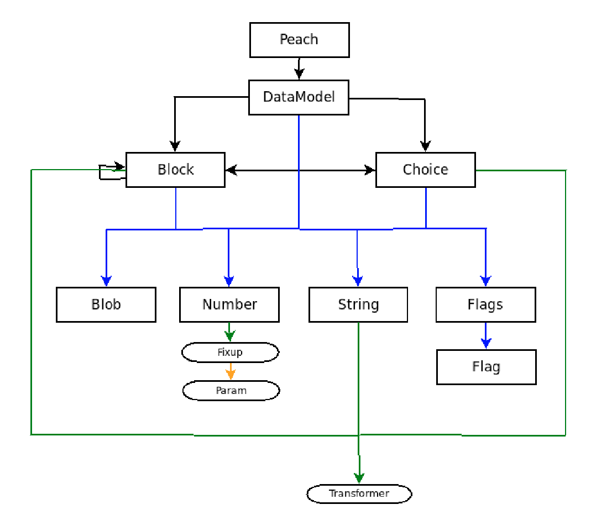

## 1. Формат Peach Pit

Формат `Peach Pit` позволяет описать структуру входных данных для фаззинга и применяемые к отдельным полям данных мутации.

Инструмент `Crusher` работает с модифицированным форматом `Peach Pit`, изначально разработанным для фаззера `Peach` - https://community.peachfuzzer.com/

Для более детального понимания работы с структурированными данными ниже рассмотрены следующие вопросы:
* что такое модель данных;
* что такое строгая модель данных;
* как описать модель данных в `Peach Pit`;
* как получить из модели данных строгую модель даных.

### 1.1 Модель данных
Под моделью данных в данном документе понимается внутреннее представление (в оперативной памяти) структуры данных на основании спецификации формата файла (условно говоря - на бумаге).

Спецификация - это строгое описание формата данных, которое может быть представлено, например, в виде RFC.

Пример описания формата ZIP - https://pkware.cachefly.net/webdocs/casestudies/APPNOTE.TXT

Фаззер не умеет работать непосредственно со спецификацией. Ему требуется иметь некое внутреннее представление (в оперативной памяти) этой спецификации.
Это внутреннее представление - и есть модель данных.

Как перевести спецификацию в модель данных?
Перевод спецификации (написанной на английском, русском языке) напрямую в модель данных - слишком сложная задача.

Но описание спецификации можно написать на другом языке, представить её в другом формате. К такому языку предъявляются следующие требования:
* возможность полного описания спецификации (как это уже сделано, например, на английском языке), без потери каких-либо деталей;
* лёгкость "понимания" такого языка компьютером.

Один из таких языков (точнее форматов) - `Peach Pit`. Получаемая при этом модель данных - `Peach DOM` (`Peach Document Object Model`).

Итого, перевод спецификации в модель данных выполняется по следующей цепочке:

Спецификация (на бумаге) -> `Peach Pit` (на диске) -> `Peach DOM` (в оперативной памяти).

Первый переход осуществляет непосредственно человек, изучая спецификацию и составляя её описание в формате `Peach Pit`.

Второй переход выполняется автоматически компьютером - в нашем случае фаззером, который далее и работает с моделью данных в виде `Peach DOM`.

На самом нижнем уровне модели данных находятся отдельные поля. Модель данных устанавливает правила, по которым из полей разных типов,
с учётом связей между полями и группами полей - формируется файл/пакет, отвечающий спецификации.

### 1.2 Строгая модель данных
Модель данных описывает всё множество файлов, отвечающих спецификации.
В общем случае (для большинства форматов) у файлов из этого множества может быть разный набор полей.

Строгая модель данных описывает конкретный набор полей. Значения этих полей могут принимать любые значения, если они не нарушают спецификации.
Модель данных - объединение всех строгих моделей данных.

### 1.3 Формат Peach Pit (модифицированный для Crusher'a)
Это XML файл, в котором можно описать модель данных и мутации над отдельными полями. 
Элемент `Peach ` - корневой. Дочерние `DataModel`-элементы обычно составляют некоторую иерархию. 
Одни элементы служат шаблонами для других, которые расширяют эти шаблоны, более детально описывая формат. 
Это требуется для дальнейшего переиспользования и более простого дополнения этого файла, например, при изменении спецификации соответствующего формата.
Модель данных фаззер извлекает из `DataModel`-элемента с атрибутом `name="FuzzDataModel"`. Остальные `DataModel`-элементы - вспомогательные и служат для удобства описания модели данных.

Формат `Peach Pit` можно представить следующей иерархической структурой:



Рис. 1. Формат Peach Pit.

Далее подробно опишем разные типы элеметов в `Peach Pit`.

#### DataModel
| Атрибут | Описание | Обязательный? |
|:-------:|:---------|:-------------:|
| `name` | уникальное имя модели данных | + |
| `ref`  | ссылка на `DataModel` <br> или `Block` (см.ниже) в качестве шаблона | - |

Дочерние элементы: `Blob`, `Number`, `String`, `Flags`, `Choice`, `Block`.

Каждый из этих элементов даёт описание одного из полей (группы полей) в модели данных.
Для использования `DataModel`-элемента в качестве шаблона его имя нужно указать в качестве значения атрибута `ref` другого `DataModel`-элемента.
При формировании модели данных по шаблону значения полей с именами, уже имеющимися в шаблоне – перезаписываются новыми значениями.

**Мутации**

Для некоторых из дочерних элементов DataModel можно задать атрибут `mutators` для указания набора мутаторов, разделённых символом ";".

Мутаторы делятся на 2 группы - генетические и пользовательские.
1) Генетические мутации:
* полный набор генетических мутаций - `GENETIC` (значение по умолчанию для полей переменной длины);
* сокращённый набор генетических мутаций - `GENETIC_REDUCED` (значение по умолчанию для полей фиксированной длины).

2) Встроенные пользовательские мутаторы:

| Мутатор            | Описание                                        |
|:-------------------|:------------------------------------------------|
| `bit_flipper_mutator` | измененяет несколько случайных байт в буфере |
| `blob_mutator` | вставляет/вырезает/заменяет случайный диапазон байт в буфере |
| `dword_slider_mutator` | заменяет в произвольной позиции в буфере 4 байта на `0xFFFFFFFF` |
| `string_case_mutator` | изменяет регистр некоторых символов в строке |
| `unicode_bad_utf8_mutator` | возвращает последовательность байт, полученную из одной из заранее сгенерированных <br> UTF-8 последовательностей |
| `unicode_bom_mutator` | возвращает один из заранее сгенерированных буферов с меткой порядка байтов |
| `unicode_strings_mutator` | возвращает последовательность байт, полученных из одной из заранее сгенерированных <br> последовательностей символов Unicode |
| `unicode_utf8_three_char_mutator` | возвращает последовательность байт, полученных из одной из заранее сгенерированных <br> последовательностей UTF-8, состоящих из повторяющегося 3х-символьного набора |
| `repeat_string` | возвращает продублированный от 2 до 10 раз исходный буфер |
| `numerical_bad_cases_mutator` | возвращает буфер, содержащий одно из целочисленных значений, способное в некоторых случаях <br> привести к целочисленному переполнению |
| `numerical_finite_random_mutator` | возвращает случайное целое число в диапазоне от 0 до 42949657 |
| `positive_numerical_add_mutator` | прибавляет к исходному числу случайное число |

Набор пользовательских мутаторов можно дополнять новыми мутаторами, реализованными в виде плагинов на языке `Python`.

#### Blob
Служит для представления данных, для которых недостаточно информации о типе или формате. Дочерний элемент `DataModel` или `Block`.

| Атрибут | Описание | Обязательный? |
|:-------:|:---------|:-------------:|
| `name`  | имя | + |
| `value` | начальное значение поля | - |
| `valueType` | формат начального значения поля: <br> `hex`, `string` (по умолчанию) или `literal` | - |
| `mutable` | является ли поле изменяемым: <br> `true` (по умолчанию) или `false` | - |
| `mutators` | набор мутаторов | - |  
| `token` | является ли элемент токеном <br> (используется только при парсинге данных) <br> по умолчанию - `false` | - |
| `minOccurs` | минимальное число раз, <br> сколько может встретиться элемент <br> в процесса разбора файла | - |
| `maxOccurs` | максимальное число раз, <br> сколько может встретиться элемент <br> в процесса разбора файла | - |
| `occurs` | точное число раз, <br> сколько может встретиться элемент <br> в процесса разбора файла | - |


Пример описания элемента `Blob`:
```xml
<Blob name="Payload" valueType="hex" value="AA BB" mutable="false" />
```

#### Number
Определяет двоичное число длиной 8, 16, 24, 32 или 64 бита. Дочерний элемент `DataModel` или `Block`.

| Атрибут | Описание | Обязательный? |
|:-------:|:---------|:-------------:|
| `name`  | имя | + |
| `size`  | размер числа в битах | + |
| `value` | начальное значение поля | - |
| `valueType` | представление значение: <br> `string` или `hex` | - |
| `endian` | порядок байтов в числе: <br> `big`, `little` (по умолчанию) <br> или `network`(как `big`) | - |
| `signed` | знаковое (по умолчанию) - `true` <br> беззнаковое - `false` | - |
| `mutable` | является ли поле изменяемым: <br> `true` (по умолчанию) или `false` | - |
| `mutators` | набор мутаторов | - |
| `token` | является ли элемент токеном <br> (используется только при парсинге данных) <br> по умолчанию - `false` | - |
| `minOccurs` | минимальное число раз, <br> сколько может встретиться элемент <br> в процесса разбора файла | - |
| `maxOccurs` | максимальное число раз, <br> сколько может встретиться элемент <br> в процесса разбора файла | - |
| `occurs` | точное число раз, <br> сколько может встретиться элемент <br> в процесса разбора файла | - |
 
Дочерние элементы: `Relation`, `Fixup` - см. ниже

#### Relation
Определяет зависимости между полями следующих типов:
* элемент X – размер элемента Y (`size`-отношение);
* элемент X – смещение элемента Y (`offset`-отношение, может быть относительным);
* элемент X - число, сколько раз встречается элемент Y (`count`-отношение - см. `*occurs`-атрибуты).
 
Если у `Number` есть дочерний `Relation`, то атрибут `mutable` элемента `Number` должен дыть выставлен в `false`.

Пример `Number` с дочерним `Relation`:

```xml
<Number name="PayloadLength" size="8" endian="big" mutable="false">
		<Relation type="size" of="Payload" />
</Number>

<Blob name="Payload" valueType="hex" value="AA BB" mutators="GENETIC" />
```

#### String
Строка. Дочерний элемент `DataModel` или `Block`.

| Атрибут | Описание | Обязательный? |
|:-------:|:---------|:-------------:|
| `name`  | имя | + |
| `value` | начальное значение поля | - |
| `length` | длина строки в байтах | - |
| `nullTerminated` | завершается ли строка символом окончания строки: <br> `true`/`false` | - |
| `padCharacter` | символ для заполнения строки до длины `length`, <br> по умолчанию - `0x00`| - |
| `mutable` | является ли поле изменяемым: <br> `true` (по умолчанию) или `false` | - |
| `mutators` | набор мутаторов | - |
| `token` | является ли элемент токеном <br> (используется только при парсинге данных) <br> по умолчанию - `false` | - |
| `minOccurs` | минимальное число раз, <br> сколько может встретиться элемент <br> в процесса разбора файла | - |
| `maxOccurs` | максимальное число раз, <br> сколько может встретиться элемент <br> в процесса разбора файла | - |
| `occurs` | точное число раз, <br> сколько может встретиться элемент <br> в процесса разбора файла | - |

Пример представления строки:
```xml
<String value="Null terminated string" nullTerminated="true" mutators="GENETIC" />
```

#### Block
Служит для группирования элементов. Дочерний элемент `DataModel` или `Block`. 
`Block` отличается от `DataModel` только местоположением в иерархии элементов `Peach Pit`.
Как элементы `Block`, так и элементы `DataModel`, могут использоваться в качестве шаблонов при объявлении других элементов `Block` и `DataModel`.

| Атрибут | Описание | Обязательный? |
|:-------:|:---------|:-------------:|
| `name`  | имя | - |
| `ref`  | ссылка на `DataModel` <br> или `Block` в качестве шаблона | - |
| `mutable` | является ли поле изменяемым: <br> `true` (по умолчанию) или `false` | - |
| `token` | является ли элемент токеном <br> (используется только при парсинге данных) <br> по умолчанию - `false` | - |
| `minOccurs` | минимальное число раз, <br> сколько может встретиться элемент <br> в процесса разбора файла | - |
| `maxOccurs` | максимальное число раз, <br> сколько может встретиться элемент <br> в процесса разбора файла | - |
| `occurs` | точное число раз, <br> сколько может встретиться элемент <br> в процесса разбора файла | - |

Пример представления блока:
```xml
<Block name="Hello world">
	<String value="Hello " />
	<String value="world!" />
</Block>
```

Дочерние элементы: `Block`, `Blob`, `Number`, `String`, `Flags`, `Choice`, `Transformer`.

#### Flags
Набор флагов. Дочерний элемент `DataModel` или `Block`.

| Атрибут | Описание | Обязательный? |
|:-------:|:---------|:-------------:|
| `name`  | имя | - |
| `value` | начальное значение поля | - |
| `size`  | длина в битах | + |
| `endian` (?) | порядок байтов в числе | - |
| `mutable` | является ли поле изменяемым: <br> `true` (по умолчанию) или `false` | - |
| `mutators` | набор мутаторов | - |
| `token` | является ли элемент токеном <br> (используется только при парсинге данных) <br> по умолчанию - `false` | - |
| `minOccurs` | минимальное число раз, <br> сколько может встретиться элемент <br> в процесса разбора файла | - |
| `maxOccurs` | максимальное число раз, <br> сколько может встретиться элемент <br> в процесса разбора файла | - |
| `occurs` | точное число раз, <br> сколько может встретиться элемент <br> в процесса разбора файла | - |

Дочерний элемент - `Flag`.

#### Flag
Флаг. Дочерний элемент `Flags`.

| Атрибут | Описание | Обязательный? |
|:-------:|:---------|:-------------:|
| `name`  | имя | - |
| `value` | начальное значение поля | - |
| `size`  | длина в битах | + |
| `position` | начальная позиция в наборе флагов | + |
| `mutable` | является ли поле изменяемым: <br> `true` (по умолчанию) или `false` | - |
| `mutators` | набор мутаторов | - |
| `token` | является ли элемент токеном <br> (используется только при парсинге данных) <br> по умолчанию - `false` | - |


Пример представления набора флагов:
```xml
<Flags name="FlagsSet" size="8" >
    <Flag name="A" size="4" position="0" />
    <Flag name="B" size="4" position="4" />
</Flags>
```

#### Choice
Выбор между несколькими форматами данных. Дочений элемент `DataModel` или `Block`.
При разборе данных выбирается первый подходящий элемент из этого списка.

| Атрибут | Описание | Обязательный? |
|:-------:|:---------|:-------------:|
| `name`  | имя | - |
| `minOccurs` | минимальное число раз, <br> сколько может встретиться элемент <br> в процесса разбора файла | - |
| `maxOccurs` | максимальное число раз, <br> сколько может встретиться элемент <br> в процесса разбора файла | - |
| `occurs` | точное число раз, <br> сколько может встретиться элемент <br> в процесса разбора файла | - |

Пример `Choice`:
```xml
<Choice name="DataChooser" minOccurs="2" >
    <Number name="A" size="32" endian="little" />
    <Number name="B" size="64" endian="little" />
</Choice>
```

#### Fixup
Этот элемент позволяет описать зависимое поле. Пример зависимости – контрольная сумма.

| Атрибут | Описание | Обязательный? |
|:-------:|:---------|:-------------:|
| `name`  | имя | - |
| `class` | `Fixup`-класс | + |

Применение методов указанного `Fixup`-класса позволит вычислить значение поля родительского элемента. 
Классы делятся на 2 группы, которые представляют: 
* детерминистические зависимости (например, контрольные суммы), примеры: `checksums.SHA256Fixup`, `checksums.Crc32Fixup`;
* случайные (или зависящие от итерации в фаззинге), примеры: `sequence.SequenceIncrementFixup`, `sequence.SequenceRandomFixup`.

Элемент `Fixup` включает в себя в качестве дочерних элементы `Param`.
Один из этих элементов обязательно должен давать ссылку на данные, на основании которых мы считаем зависимое значение.

Пример:
```xml
<String name="Payload" value="ABCDE" />
<Number name="CRC" size="32" signed="false" endian="network" >
    <Fixup class="checksums.Crc32Fixup" >
        <Param name="ref" value="Payload" />
    </Fixup>
</Number>
```

#### Transformer
Выполняет преобразование над данными родительского элемента.

| Атрибут | Описание | Обязательный? |
|:-------:|:---------|:-------------:|
| `name`  | имя | - |
| `class` | `Transformer`-класс | + |

`Transformer`-класс - класс трансформации, выполняющейся над данными. 
Есть несколько групп таких классов: asn1, compress, encode, fcrypt, md5crypt, misc, type. Примеры классов: crypto.UnixMd5Crypt, type.IntToHex.
Более подробно об этих классах можно узнать в документации, прилагающейся к фаззеру Peach 2.3

Пример:
```xml
<String type="char" value="data">
    <Transformer class="asn1.BerEncodeOctetString" />
</String>
```

#### Пример Peach Pit файла
```xml
<Peach>

    <DataModel name="HandshakePacketTemplate">
        <Block name="Headers">
            <Blob name="ContentType" valueType="hex" value="16" mutable="false"/>
            <Blob name="Version" valueType="hex" value="03 01" mutable="false"/>
            <Blob name="LengthHandshakeMessage" valueType="hex" value="40 00" mutable="false"/>
            <Blob name="LengthOfChallenge" valueType="hex" value="01 00" mutable="false"/>
        </Block>

        <Number name="DataLength" size="16" value="0" />
        <Blob name="Data" valueType="hex" value="00" />
    </DataModel>

    <DataModel name="FuzzDataModel" ref="HandshakePacketTemplate" >
        <Number name="DataLength" size="16" signed="false" endian="big" mutable="false">
            <Relation type="size" of="Data"/>
        </Number>
        <Blob name="Data" valueType="hex" value="AA" mutators="repeat_string;blob_mutator;bit_flipper_mutator"/>
    </DataModel>
    
</Peach>
```

### 1.4 От модели данных к строгой модели данных
Если из множества файлов, отвечающих модели данных, выбрать файл и *разобрать* его в соответствии с этой моделью данных,
то разрешатся неоднозначности (элементы `Choice`, `*occurs`-атрибуты) и получится просто набор полей.

Этот набор и задаёт строгую модель данных. В процессе фаззинга мутации работают именно со строгими моделями данных.


## 2. Peach Pits для разных форматов файлов
Peach Pits для некоторых популярных форматов файлов + примеры к ним - см. [Examples](Examples)
